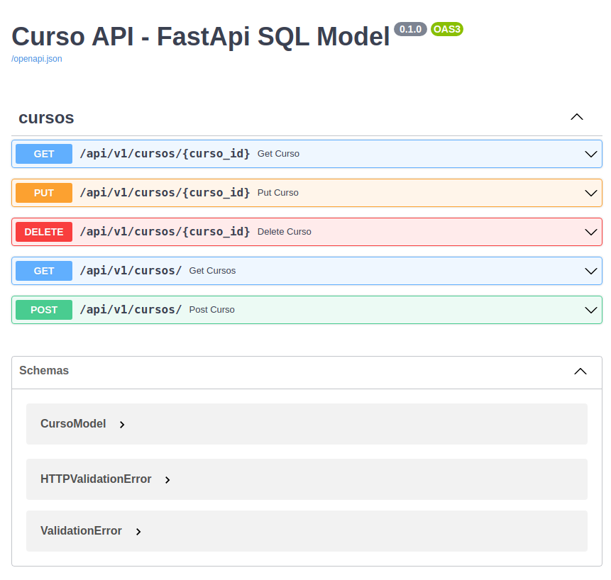

# crud_FastApi_sql_model-

FastApi - Crud com FastApi e SQL Model com Python

A Api tem como objetivo ter 5 endpoints:
- GET curso
    - Endpoint para retorna um curso específico
- GET cursos
    - Endpoint para retorna todos os cursos encontrados
- POST curso
    - Endipoint para criar um novo curso
- PUT curso
    - Endpoint para atualizar um curso específico
- DELETE curso
    - Endpoint para excluir um curso específico

## Tecnologias usadas
Projeto de Api usando as tecnologias:
- Poetry
- Python
    - As dependências então no arquivo [pyproject.toml](pyproject.toml)
- Docker/Docker compose
    - Bando de dados Postgresql

## Executando API
Para executar:
- Instalar o poetry
- Instalar docker/Docker Compose
- No diretorio raiz do projeto: 
    - pelo terminal, execute `poetry install`, para instalar as dependências 
    - para subir o banco de dados usando `docker compose`
        - pelo terminal,execute o comando `docker compose up --build -d` 

Com as configurações iniciais feitas, execute o comando `python main.py`

Para ver a documentação da api, com ela executando, basta acessar pelo navegador:
`http://0.0.0.0:8000/docs`

## Github Action

GitHub Actions é uma plataforma de integração contínua e entrega contínua (CI/CD) que permite automatizar a sua compilação, testar e pipeline de implantação.

- A pipeline vai aplica formatação de codigo usando `black`, `isort` e `flake8`, no caso do flacke8 caso algo não esteja de acordo, ela quebra
